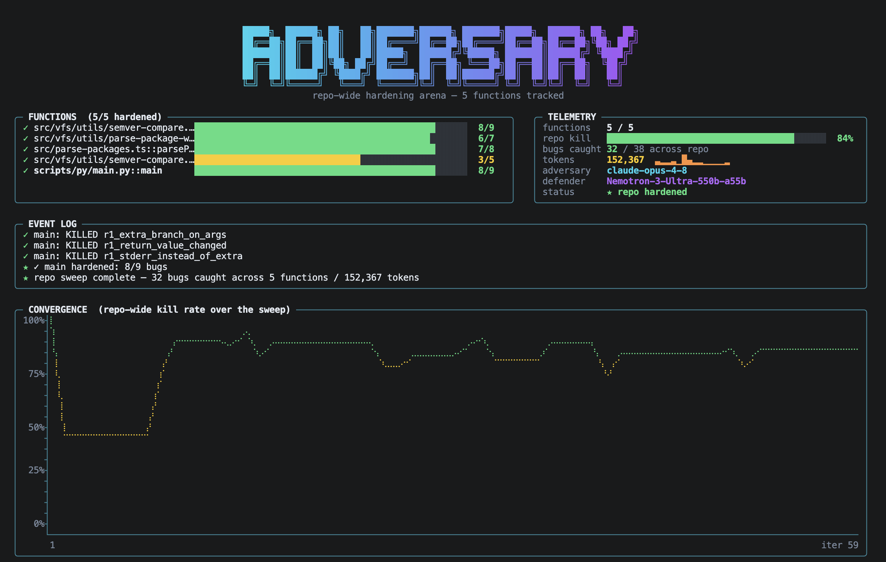
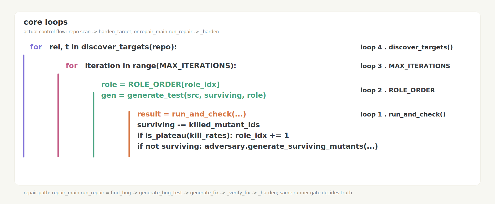

# adversarial-testing

<p align="center">
  
</p>

An adversarial test-generation loop for real code. The model proposes tests, but the
score comes from the runner: a mutant is killed only when the generated test passes on
the reference implementation and fails on the broken implementation. No LLM judges the
result.

The repo contains two loops built on that same contract:

- `main.py` hardens a test suite against generated or fixture mutants.
- `repair_main.py` finds a real bug, writes a failing test, fixes the code, then
  mutation-tests the new regression test.
- `orchestrate.py` composes them as repair → harden on one target.

## How it works

<p align="center">
  
</p>

The mutation path is concrete:

1. `discover_targets(repo)` finds self-contained Python/TypeScript functions.
2. `acquire.generate_mutants` builds compile-checked mutants for a target.
3. `harden_target` loops up to `MAX_ITERATIONS`.
4. `ROLE_ORDER = ["bulk", "strategy"]` starts cheap and escalates on plateau.
5. `generate_test(src, surviving, role)` proposes one test.
6. `run_and_check(test, src, surviving)` runs pytest/vitest and returns killed mutants.
7. `surviving` shrinks; if a wave is cleared, `adversary.generate_surviving_mutants` can add harder bugs.

The repair path reuses the same runner gate:

`find_bug → generate_bug_test → generate_fix → _verify_fix → _harden`

| File | Role |
|------|------|
| `discover.py` / `acquire.py` | scan repos, select functions, generate compile-checked mutants |
| `generator.py` | asks the model for one adversarial pytest/vitest test |
| `runner.py` / `runner_ts.py` | ground-truth verifier: reference must pass, mutant must fail |
| `main.py` | mutation loop: generate tests, kill mutants, escalate on plateau |
| `repair_main.py` | repair loop: find bug, write failing test, fix, then harden |
| `demo.py` | terminal visualization of the loop |
| `bench.py` | deterministic regression benchmark for the loop mechanics |

### Targets

Pick a target with `FIXTURE` (default `toy`):

- **`toy`** (Python) — `merge_intervals` + 5 mutants. pytest verifier.
- **`duration_ts`** (TypeScript) — `parseDuration`, sourced from
  [NVIDIA/NemoClaw `src/lib/domain/duration.ts`](https://github.com/NVIDIA/NemoClaw/blob/main/src/lib/domain/duration.ts),
  + 5 mutants (incl. `M2_no_cap`, which drops the 30-minute "shields-down" security cap).
  vitest verifier.
- **`nemoclaw_duration_repo`** (TypeScript, repo-backed) — the same `parseDuration`, but read
  from a local NemoClaw checkout and tested through NemoClaw's **own** vitest config (see
  "Repo-backed mode" below).

## Requirements

- Python 3.9+ and `pytest`
- `matplotlib` — optional, only for rendering `repair_curve.png` (`pip install matplotlib`)
- A model backend — pick one:
  - **CLI (default, zero-config):** the [`claude`](https://docs.claude.com/claude-code) CLI,
    logged in. Uses your local Claude auth — no API key, no SDK install.
  - **SDK:** `pip install anthropic openai python-dotenv` and set `ANTHROPIC_APIKEY`
    (strategy tier) and/or `NEBIUS_APIKEY` (bulk tier).

## Run

```bash
pip install -r requirements.txt
python main.py
```

Run a single iteration (handy for a quick check or demo):

```bash
MAX_ITERATIONS=1 python main.py
```

Terminal visualization:

```bash
python demo.py --snapshot --max-iter 2
```

Real output from a 1-iteration run on `fixtures/toy.py`:

```
baseline kill_rate=1.000 tokens=3289
iter  tier      cum_tokens   cost$    kill_rate  killed_this_round
   1  bulk            4035   0.151      1.000  ['M1_no_sort', 'M2_strict_overlap', 'M3_overwrite_end', 'M4_drop_last', 'M5_empty_returns_none']
all 5 mutants killed at iteration 1
final kill_rate=1.000 over 5 mutants, cost=$0.1507, log at run.jsonl
```

On this toy the cheap `bulk` tier (haiku) writes one strong test that kills all five
mutants in the first iteration, so the loop stops on full-kill. Per-iteration progress is
also appended to `run.jsonl`:

```json
{"iteration": 1, "cumulative_tokens": 4035, "kill_rate": 1.0, "killed_this_round": ["M1_no_sort", "M2_strict_overlap", "M3_overwrite_end", "M4_drop_last", "M5_empty_returns_none"], "tier": "bulk", "cost_usd": 0.1507}
```

### TypeScript target (NemoClaw `parseDuration`)

One-time: install the standalone vitest harness (kept out of the loop's package graph):

```bash
cd ts_harness && npm install && cd ..
```

Then run the loop against the TS fixture (needs Node ≥18 + `claude` on PATH):

```bash
FIXTURE=duration_ts MAX_ITERATIONS=1 python main.py
```

Real output — the LLM writes a `vitest` test that kills all 5 mutants, including the
security cap removal:

```
baseline kill_rate=1.000 tokens=2129
iter  tier      cum_tokens   cost$    kill_rate  killed_this_round
   1  bulk            1956   0.141      1.000  ['M1_minute_multiplier', 'M2_no_cap', 'M3_default_unit_minutes', 'M4_allow_zero', 'M5_empty_returns_default']
all 5 mutants killed at iteration 1
final kill_rate=1.000 over 5 mutants, cost=$0.1407, log at run.jsonl
```

## Run against any repo

Point the loop at a repo and let it pick self-contained targets:

```bash
python3 main.py repo=https://github.com/fiberplane/honcpiler max_targets=3 mutants=5
```

Or point it at one function directly. It fetches the file, asks the strategy model to
generate realistic mutants, compile-checks each mutant, infers the language from the
extension, and runs the loop:

```bash
python3 main.py \
  repo=https://github.com/NVIDIA/NemoClaw \
  file=src/lib/domain/duration.ts \
  function=parseDuration \
  mutants=5
```

Real output — mutants are **auto-generated and compile-checked**, then killed:

```
[acquire] https://github.com/NVIDIA/NemoClaw :: src/lib/domain/duration.ts (typescript), target `parseDuration`
[acquire] 5 valid mutants: ['off_by_one_max', 'wrong_max_constant', 'zero_guard_allows_zero', 'wrong_default_unit', 'wrong_minute_multiplier']
baseline kill_rate=1.000 tokens=2509
iter  tier      cum_tokens   cost$    kill_rate  killed_this_round
   1  bulk            2817   0.035      1.000  ['off_by_one_max', 'wrong_max_constant', 'zero_guard_allows_zero', 'wrong_default_unit', 'wrong_minute_multiplier']
all 5 mutants killed at iteration 1
final kill_rate=1.000 over 5 mutants, cost=$0.0346, log at run.jsonl
```

| Arg | Meaning |
|-----|---------|
| `repo=` | a **local checkout path** (read from disk, no network), a repo URL (`https://github.com/owner/name`), or `owner/name` |
| `file=` | path to the source file (within the repo / checkout) |
| `function=` | the function under test |
| `mutants=` | how many mutants to generate (default 5) |

Already have the repo cloned? Point `repo=` at it to skip the fetch entirely:

```bash
python3 main.py repo=~/Codes/NemoClaw file=src/lib/domain/duration.ts function=parseDuration
```

Language is inferred from the file extension (`.ts`/`.tsx` → vitest, `.py` → pytest).
For remote GitHub files, the loader tries `gh api` first and falls back to a shallow public
clone if `gh` is unavailable or unauthenticated. For TypeScript, install the harness once
(`cd ts_harness && npm install`). Env vars (iterations, caps, backend) apply as below.

**Limitations (today):** the target file must be **self-contained** (no unresolved
imports) so it loads in the standalone harness — `duration.ts` qualifies. Any mutant that
fails to compile is dropped, so a broken mutant never counts as a false kill.

## Repo-backed mode (real NemoClaw checkout)

The CLI above fetches a single file and tests it in an isolated harness. **Repo-backed
mode** is the highest-fidelity verifier: it runs the generated test through the *target
repo's own* `vitest` config, against the real source file swapped in place.

```bash
# one-time: a local NemoClaw checkout with deps installed
git clone https://github.com/NVIDIA/NemoClaw ~/Codes/NemoClaw
cd ~/Codes/NemoClaw && npm ci && cd -

FIXTURE=nemoclaw_duration_repo python main.py
```

How it works (`runner_repo_ts.py`): copy the checkout to a temp workspace (skipping
`.git`/`node_modules`, symlinking installed deps) → write the generated test beside the
target file → swap in the reference / each mutant at `src/lib/domain/duration.ts` → run
`npx vitest run --project cli <test>` so the repo's real config decides pass/fail. The
fixture (`fixtures/nemoclaw_duration_repo.py`) reads the live source and derives its 5
mutants by patching it, so it tracks whatever NemoClaw currently ships.

Config (env): `NEMOCLAW_REPO_PATH` (checkout location, default `~/Codes/NemoClaw`),
`NODE_BIN` (prepend a Node toolchain to PATH), `REPO_VITEST_TIMEOUT` (per-run seconds,
default 90).

## Configuration

All optional, via environment variables:

| Variable | Default | Meaning |
|----------|---------|---------|
| `FIXTURE` | `toy` | which target to run: `toy` (Python) or `duration_ts` (TypeScript) |
| `BACKEND` | `cli` | `cli` (uses `claude -p`), `sdk` (Anthropic/Nebius SDKs), or `stub` (deterministic offline, no network) |
| `BULK_MODEL` | `haiku` | cheap tier — model alias for the CLI backend |
| `STRATEGY_MODEL` | `opus` | smart tier used when the loop escalates |
| `MAX_ITERATIONS` | `25` | hard cap on loop iterations |
| `COST_CAP` | `5.0` | stop once cumulative cost (USD) hits this (`0` disables) |
| `TOKEN_CAP` | `0` | stop once cumulative tokens hit this (`0` disables) |
| `ANTHROPIC_APIKEY` / `NEBIUS_APIKEY` | — | only for `BACKEND=sdk` |

## Stop conditions

The loop ends on the first of:
1. **Full kill** — every mutant killed (`kill_rate == 1.0`).
2. **Plateau on the strongest tier** — no kill-rate progress after escalating bulk → strategy.
3. **Budget cap** — `COST_CAP` or `TOKEN_CAP` reached.
4. **`MAX_ITERATIONS`** — hard backstop.

A real backend (`cli`/`sdk`) that errors (auth, rate-limit, transport) now **fails loud** —
`llm.complete` raises rather than silently returning a stub, so a credential problem can't
masquerade as an (empty) plateau. Use `BACKEND=stub` for the explicit offline path.

> **Reproducibility & safety.** Runs are deterministic only under `BACKEND=stub`; the SDK
> path defaults to `temperature=0` but the `claude` CLI backend has no reliable seed and is
> non-deterministic by design. The runner **executes LLM-generated code on the host** — run
> it only against trusted targets. Container-level isolation is future work.

## Adding your own target

Drop a new module into `fixtures/` exposing `REFERENCE_SRC`, `MUTANTS` (a list of
`{"id", "description", "src"}`), and `LANGUAGE` (`"python"` or `"typescript"`; TS fixtures
also set `FUNCTION_NAME`). Select it with `FIXTURE=<module>`. The runner derives the
function under test from the reference and runs the same generated test against the
reference and every mutant — for Python via a pytest fixture, for TypeScript by swapping
`ts_harness/impl.ts`.

## Find-and-fix mode (`repair_main.py`)

Where the mutation loop assumes the code is correct and hardens the *tests*, find-and-fix
assumes the code is **buggy** and repairs it. Each iteration finds one real defect, writes
a test that captures the correct behavior (red on the buggy code, green once fixed),
patches the code, verifies the red→green transition, then **mutation-tests the new suite**
to prove the generated tests actually catch regressions.

```
observe code + bugs-already-fixed (memory)
  ─▶ find a bug (Claude)  ─▶ write a failing test (Nebius)  ─▶ fix the code (Claude)
       ─▶ verify red→green (runner)  ──reject──▶ record attempt, try next
              └──accept──▶ code = fixed, add test to suite
                   ─▶ mutate the fixed code, run suite vs mutants
                        ─▶ survivors? write more tests until they're killed
                   ─▶ log {bugs_fixed, kill_rate}  ─▶ repeat until no bug remains
```

| File | Role |
|------|------|
| `fixtures/buggy.py` | **target** — a single-function `grade` with 3 planted bugs + correct oracle |
| `strategy.py` | `find_bug(observation)` — Claude identifies one unfixed defect from the code + memory |
| `repair_generator.py` | `generate_bug_test` — Nebius writes a fixture-style test that exposes the bug |
| `fixer.py` | `generate_fix(code, bug, test)` — Claude patches the module |
| `repair_main.py` | the loop: find → test → fix → verify → harden → report |
| `repair_plot.py` | plots bugs-fixed + suite kill-rate vs cumulative tokens → `repair_curve.png` |

It reuses the **frozen contracts** unchanged: `generator.generate_test` (for the hardening
step) and `runner.run_and_check` / `llm.complete`. Fix verification is the same
`run_and_check` with roles inverted — the **fixed code as the reference** and the **buggy
original as the lone mutant** — so "mutant killed" means "the test fails on the old buggy
code" (a genuine red→green).

### Run

```bash
pip install pytest          # plus the `claude` CLI logged in (default backend)
python repair_main.py
pip install matplotlib       # only needed for the plot below
python repair_plot.py        # optional: render repair_curve.png
```

`repair_plot.py` renders a proper labeled, dual-axis chart when **matplotlib** is
installed (`pip install matplotlib`). Without it, the script falls back to a tiny built-in
PNG writer that draws the curves but no axis tick labels — install matplotlib for the
readable version.

#### Repair any repo (CLI)

Point the repair loop at a **buggy** function in any repo — no fixture, no answer key. It
loads the source (local checkout path or GitHub URL, same as the mutation loop), repairs it
iteratively, and reports fixes made + the suite kill-rate measured against mutants discovered
from the corrected code:

```bash
python repair_main.py repo=<url-or-path> file=path/to/file.py function=my_fn
```

Python targets only for now (the repair internals — `ast`-based test mangling, the pytest
runner — are Python-specific); a non-`.py` `file=` exits with a clear "Python only" message.
Without `repo=`/`file=` it runs the built-in planted `grade` fixture as before.

Deterministic offline run (stub backend, no model calls):

```
$ BACKEND=stub python repair_main.py
blind one-shot baseline: fixed 1/3 bugs in 226 tokens (produces no tests)
iter  cum_tokens  bugs_fixed   kill_rate  tests  note
   1        1673        1/3      0.333      1  fixed via B1_zero_total
   2        3424        1/3      0.333      1  no valid fix in 3 tries (1/3)
   3        4944        2/3      0.667      2  fixed via B2_clamp_high
   4        6787        2/3      0.667      2  no valid fix in 3 tries (1/3)
   5        7638        3/3      1.000      3  fixed via B3_clamp_low
all 3 planted bugs fixed and suite kills every regression at iter 5
LOOP    : fixed 3/3 planted bugs, 3 regression tests, 100% kill-rate, 7638 tokens
BASELINE: fixed 1/3 planted bugs, 0 regression tests, 226 tokens (blind one-shot)
log at repair_run.jsonl
```

This is the case for the loop: a single all-at-once "fix every defect" attempt patches
the obvious `ZeroDivisionError` crash but misses the two subtler boundary clamps — **1/3
bugs** for 226 tokens. The iterative loop's find → test → verify cycle closes all **3/3**,
trading more tokens for complete repair. In `repair_curve.png` the red ✕ (one-shot) sits
at 1 bug while the blue line climbs to 3.

Two metrics climb together: **bugs fixed** (repair progress) and **suite kill-rate** (test
quality). Progress is appended to `repair_run.jsonl`, with the one-shot baseline in
`repair_baseline.json`.

> **Note:** the shared runner rewrites `impl.py` per implementation in one reused temp dir,
> so `import impl` could load cached bytecode and report a wrong kill on multi-mutant calls.
> `runner.py` now runs each pytest subprocess with `PYTHONDONTWRITEBYTECODE=1`, so every
> implementation always loads fresh source — no caller-side workaround needed.

## Orchestrated run (`orchestrate.py`)

A thin orchestrator runs both loops as two **phases on one target** with a single token
budget and a combined report — repair the code, then harden the resulting suite to plateau:

```
Phase 1 · REPAIR  → run the find-and-fix loop until no bug remains (fixes code + seeds suite)
Phase 2 · HARDEN  → mutate the corrected code, keep generating tests (escalating bulk→strategy)
                    until full-kill, kill-rate plateau, or budget cap
→ "repaired N/total bugs, final suite kill-rate X%, total tokens T"
```

```bash
python orchestrate.py
```

Deterministic offline run (stub backend):

```
$ BACKEND=stub python orchestrate.py
=== PHASE 1: REPAIR (find & fix real bugs) ===
...
LOOP    : fixed 3/3 planted bugs, 3 regression tests, 100% kill-rate, 7638 tokens
=== PHASE 2: HARDEN (mutation-test the repaired code to plateau) ===
harden          1               7638  bulk          1.000  0
=== ORCHESTRATION COMPLETE ===
repaired 3/3 planted bugs
final suite kill-rate 1.000 (3 tests, stop: full-kill)
total tokens 7638 (repair 7638 + harden 0)
```

`main.py` and `repair_main.py` stay usable standalone — the orchestrator just composes
them via the shared contracts (it imports `run_repair` and reuses `generate_test` /
`run_and_check`). Config: `ORCH_HARDEN_ITERS` (Phase 2 iteration cap, default 12) and
`ORCH_TOKEN_CAP` (total-token budget across both phases, `0` disables).

## Running the tests

The harness has its own pytest suite under `tests/`. It runs fully offline (no network, no
model calls) by pinning the deterministic stub backend:

```bash
BACKEND=stub pytest -q
```

It covers the runner's kill detection (including a multi-mutant regression test for the
stale-`.pyc` bug), the kill-rate/plateau metrics, the repo/JSON/code parsers, the loud-failure
contract (a real backend with no credentials raises rather than stubbing), and the repair
loop's offline demo (3/3 planted bugs). TS/`npx`-dependent assertions skip when Node is absent.

## Benchmark drift

`bench.py` runs deterministic stub-backed scenarios and compares their final metrics with
`bench_baseline.json`. Use it to catch accidental changes in loop mechanics:

```bash
python bench.py
python bench.py --update   # accept intentional metric changes
```

## Roadmap

- **Files with imports:** resolve sibling modules into the harness so non-self-contained
  functions can be targeted (today the target file must be self-contained).
- **Backend resilience:** keep repo discovery useful when a live strategy backend is down.
- **Higher-fidelity repo runners:** support more real-project test runners beyond the current
  pytest/vitest paths.

## License

Released under the [MIT License](LICENSE).
