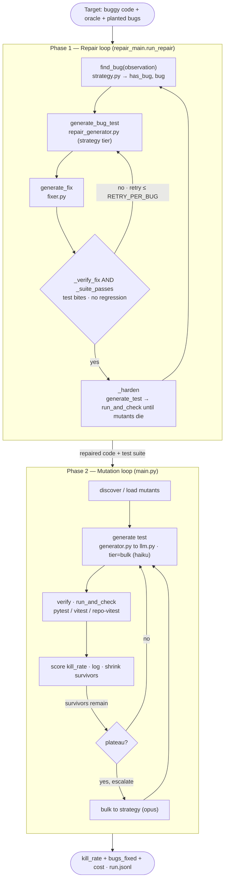

# adversarial-testing

A self-improving **mutation-testing loop**: an LLM writes tests (pytest or vitest) that try
to *kill* deliberately-buggy variants ("mutants") of a reference implementation. The loop
keeps generating tests against the mutants still alive, escalating from a cheap model to
a strong one when progress stalls, and stops when every mutant is killed or a budget cap
is hit.

The signal that drives the loop is **ground truth, not opinion**: a mutant is "killed"
only when the generated test *passes* on the correct reference and *fails* on the mutant.
The test runner (pytest or vitest) decides — no LLM judges the result.

> **Two loops live in this repo.** The **mutation loop** above (`main.py`) hardens a test
> suite against planted mutants. A second **find-and-fix loop** (`repair_main.py`) reuses
> the same runner/LLM contracts to *repair real bugs* — find a defect, write a failing
> test, fix the code, then mutation-test the new test to prove it bites. See
> [Find-and-fix mode](#find-and-fix-mode-repair_mainpy). To run both as one pipeline
> (repair → harden) on a single target, use [`orchestrate.py`](#orchestrated-run-orchestratepy).

## How it works



Both loops share one **ground-truth contract**: a bug/mutant is only "caught" when a test
*passes on the correct code and fails on the broken code* — the test runner decides, not the
model. `main.py` runs the mutation loop alone, `repair_main.py` runs the repair loop alone, and
`orchestrate.py` runs Phase 1 → Phase 2 as a single repair-then-harden pipeline.

### As nested loops

The same system as nested loops (bounded `for … in range(...)` with early-exit stop
conditions). Every name below is greppable in the repo:

```
orchestrate.main()                                       # the run · orchestrate.py
│
├─ run_repair(buggy, oracle, planted_bugs)               # PHASE 1 · repair_main.py
│    for iteration in range(MAX_ITERATIONS):             #   per defect
│        decision = find_bug(observation)                #     strategy.find_bug → has_bug, bug
│        for attempt in range(RETRY_PER_BUG + 1):        #     retry a test+fix pair
│            generate_bug_test(code, bug)                #       repair_generator (strategy tier)
│            generate_fix(code, bug, test)               #       fixer
│            if _verify_fix(...) and _suite_passes(...): #       accept: bites + no regression → break
│        _discover_mutants(code)                         #     on accept (bulk tier)
│        _harden(code, accepted_tests, mutants):         #     strengthen the suite
│            for attempt in range(HARDEN_ATTEMPTS):      #
│                generate_test(code, surviving)          #         generator
│                _measure_kill_rate(...)                 #         → runner.run_and_check
│                    for m in mutants:                   #             per mutant
│                        _pytest_passes(test, m)         #               per run · GROUND TRUTH
│        # stop: (graded == total and kill_rate >= 1)  or  no_progress >= PATIENCE
│
└─ _phase2_harden(repaired_code, suite)                  # PHASE 2 · orchestrate.py
     for iteration in range(HARDEN_MAX):                 #   per round
         generate_test(code, surviving)                  #     bulk → escalate to strategy on plateau
         _measure_kill_rate(...) → run_and_check          #     per mutant → per run
```

| In the diagram | Real symbol · file |
|---|---|
| `find_bug` | `strategy.find_bug` |
| `generate_bug_test` | `repair_generator.generate_bug_test` |
| `generate_fix` | `fixer.generate_fix` |
| `_verify_fix` · `_suite_passes` · `_discover_mutants` · `_harden` · `_measure_kill_rate` · `run_repair` | `repair_main.py` |
| `generate_test` | `generator.generate_test` |
| `run_and_check` · `_pytest_passes` | `runner.py` |
| `_phase2_harden` · `main` | `orchestrate.py` |

Note: the **retry** loop (`RETRY_PER_BUG`) and the **harden** loop (`HARDEN_ATTEMPTS`) are
*siblings* inside the per-defect iteration, not a single deep chain; `main.py` standalone is
just the mutation loop (`generate_test → run_and_check`, escalate on plateau).

| File | Role |
|------|------|
| `fixtures/` | targets — each exposes `REFERENCE_SRC`, `MUTANTS`, and a `LANGUAGE` |
| `generator.py` | asks the LLM for one test (pytest or vitest) targeting the *surviving* mutants |
| `runner.py` | Python verifier — runs the test vs reference (must pass) + each mutant (must fail) → kills |
| `runner_ts.py` | TypeScript verifier — same contract, via a standalone `vitest` project (`ts_harness/`) |
| `runner_repo_ts.py` | TypeScript verifier that runs inside a real repo checkout, using the repo's own `vitest` config |
| `harness.py` | kill-rate metric, plateau detector, JSONL logger, baseline |
| `main.py` | the loop: bulk tier → plateau → escalate to strategy tier → budget-cap stop |
| `llm.py` | two-tier model router (cheap "bulk" vs smart "strategy") with pluggable backend |

### Targets

Pick a target with `FIXTURE` (default `toy`):

- **`toy`** (Python) — `merge_intervals` + 5 mutants. pytest verifier.
- **`duration_ts`** (TypeScript) — `parseDuration`, sourced from
  [NVIDIA/NemoClaw `src/lib/domain/duration.ts`](https://github.com/NVIDIA/NemoClaw/blob/main/src/lib/domain/duration.ts),
  + 5 mutants (incl. `M2_no_cap`, which drops the 30-minute "shields-down" security cap).
  vitest verifier.
- **`nemoclaw_duration_repo`** (TypeScript, repo-backed) — the same `parseDuration`, but read
  from a local NemoClaw checkout and tested through NemoClaw's **own** vitest config (see
  "Repo-backed mode" below).

## Requirements

- Python 3.9+ and `pytest`
- `matplotlib` — optional, only for rendering `repair_curve.png` (`pip install matplotlib`)
- A model backend — pick one:
  - **CLI (default, zero-config):** the [`claude`](https://docs.claude.com/claude-code) CLI,
    logged in. Uses your local Claude auth — no API key, no SDK install.
  - **SDK:** `pip install anthropic openai python-dotenv` and set `ANTHROPIC_APIKEY`
    (strategy tier) and/or `NEBIUS_APIKEY` (bulk tier).

## Run

```bash
pip install pytest          # plus the `claude` CLI logged in (default backend)
python main.py
```

Run a single iteration (handy for a quick check or demo):

```bash
MAX_ITERATIONS=1 python main.py
```

Real output from a 1-iteration run on `fixtures/toy.py`:

```
baseline kill_rate=1.000 tokens=3289
iter  tier      cum_tokens   cost$    kill_rate  killed_this_round
   1  bulk            4035   0.151      1.000  ['M1_no_sort', 'M2_strict_overlap', 'M3_overwrite_end', 'M4_drop_last', 'M5_empty_returns_none']
all 5 mutants killed at iteration 1
final kill_rate=1.000 over 5 mutants, cost=$0.1507, log at run.jsonl
```

On this toy the cheap `bulk` tier (haiku) writes one strong test that kills all five
mutants in the first iteration, so the loop stops on full-kill. Per-iteration progress is
also appended to `run.jsonl`:

```json
{"iteration": 1, "cumulative_tokens": 4035, "kill_rate": 1.0, "killed_this_round": ["M1_no_sort", "M2_strict_overlap", "M3_overwrite_end", "M4_drop_last", "M5_empty_returns_none"], "tier": "bulk", "cost_usd": 0.1507}
```

### TypeScript target (NemoClaw `parseDuration`)

One-time: install the standalone vitest harness (kept out of the loop's package graph):

```bash
cd ts_harness && npm install && cd ..
```

Then run the loop against the TS fixture (needs Node ≥18 + `claude` on PATH):

```bash
FIXTURE=duration_ts MAX_ITERATIONS=1 python main.py
```

Real output — the LLM writes a `vitest` test that kills all 5 mutants, including the
security cap removal:

```
baseline kill_rate=1.000 tokens=2129
iter  tier      cum_tokens   cost$    kill_rate  killed_this_round
   1  bulk            1956   0.141      1.000  ['M1_minute_multiplier', 'M2_no_cap', 'M3_default_unit_minutes', 'M4_allow_zero', 'M5_empty_returns_default']
all 5 mutants killed at iteration 1
final kill_rate=1.000 over 5 mutants, cost=$0.1407, log at run.jsonl
```

## Run against any repo (CLI)

Point the loop at a function in **any GitHub repo** — no fixture authoring. It fetches the
file, asks the strategy model to generate realistic mutants (each validated to compile),
infers the language from the extension, and runs the loop:

```bash
python3 main.py \
  repo=https://github.com/NVIDIA/NemoClaw \
  file=src/lib/domain/duration.ts \
  function=parseDuration \
  mutants=5
```

Real output — mutants are **auto-generated and compile-checked**, then killed:

```
[acquire] https://github.com/NVIDIA/NemoClaw :: src/lib/domain/duration.ts (typescript), target `parseDuration`
[acquire] 5 valid mutants: ['off_by_one_max', 'wrong_max_constant', 'zero_guard_allows_zero', 'wrong_default_unit', 'wrong_minute_multiplier']
baseline kill_rate=1.000 tokens=2509
iter  tier      cum_tokens   cost$    kill_rate  killed_this_round
   1  bulk            2817   0.035      1.000  ['off_by_one_max', 'wrong_max_constant', 'zero_guard_allows_zero', 'wrong_default_unit', 'wrong_minute_multiplier']
all 5 mutants killed at iteration 1
final kill_rate=1.000 over 5 mutants, cost=$0.0346, log at run.jsonl
```

| Arg | Meaning |
|-----|---------|
| `repo=` | a **local checkout path** (read from disk, no network), a repo URL (`https://github.com/owner/name`), or `owner/name` |
| `file=` | path to the source file (within the repo / checkout) |
| `function=` | the function under test |
| `mutants=` | how many mutants to generate (default 5) |

Already have the repo cloned? Point `repo=` at it to skip the fetch entirely:

```bash
python3 main.py repo=~/Codes/NemoClaw file=src/lib/domain/duration.ts function=parseDuration
```

Language is inferred from the file extension (`.ts`/`.tsx` → vitest, `.py` → pytest).
Requires the `gh` CLI authenticated; for TypeScript, install the harness once
(`cd ts_harness && npm install`). Env vars (iterations, caps, backend) apply as below.

**Limitations (today):** the target file must be **self-contained** (no unresolved
imports) so it loads in the standalone harness — `duration.ts` qualifies. Any mutant that
fails to compile is dropped, so a broken mutant never counts as a false kill.

## Repo-backed mode (real NemoClaw checkout)

The CLI above fetches a single file and tests it in an isolated harness. **Repo-backed
mode** is the highest-fidelity verifier: it runs the generated test through the *target
repo's own* `vitest` config, against the real source file swapped in place.

```bash
# one-time: a local NemoClaw checkout with deps installed
git clone https://github.com/NVIDIA/NemoClaw ~/Codes/NemoClaw
cd ~/Codes/NemoClaw && npm ci && cd -

FIXTURE=nemoclaw_duration_repo python main.py
```

How it works (`runner_repo_ts.py`): copy the checkout to a temp workspace (skipping
`.git`/`node_modules`, symlinking installed deps) → write the generated test beside the
target file → swap in the reference / each mutant at `src/lib/domain/duration.ts` → run
`npx vitest run --project cli <test>` so the repo's real config decides pass/fail. The
fixture (`fixtures/nemoclaw_duration_repo.py`) reads the live source and derives its 5
mutants by patching it, so it tracks whatever NemoClaw currently ships.

Config (env): `NEMOCLAW_REPO_PATH` (checkout location, default `~/Codes/NemoClaw`),
`NODE_BIN` (prepend a Node toolchain to PATH), `REPO_VITEST_TIMEOUT` (per-run seconds,
default 90).

## Configuration

All optional, via environment variables:

| Variable | Default | Meaning |
|----------|---------|---------|
| `FIXTURE` | `toy` | which target to run: `toy` (Python) or `duration_ts` (TypeScript) |
| `BACKEND` | `cli` | `cli` (uses `claude -p`) or `sdk` (Anthropic/Nebius SDKs) |
| `BULK_MODEL` | `haiku` | cheap tier — model alias for the CLI backend |
| `STRATEGY_MODEL` | `opus` | smart tier used when the loop escalates |
| `MAX_ITERATIONS` | `25` | hard cap on loop iterations |
| `COST_CAP` | `5.0` | stop once cumulative cost (USD) hits this (`0` disables) |
| `TOKEN_CAP` | `0` | stop once cumulative tokens hit this (`0` disables) |
| `ANTHROPIC_APIKEY` / `NEBIUS_APIKEY` | — | only for `BACKEND=sdk` |

## Stop conditions

The loop ends on the first of:
1. **Full kill** — every mutant killed (`kill_rate == 1.0`).
2. **Plateau on the strongest tier** — no kill-rate progress after escalating bulk → strategy.
3. **Budget cap** — `COST_CAP` or `TOKEN_CAP` reached.
4. **`MAX_ITERATIONS`** — hard backstop.

## Adding your own target

Drop a new module into `fixtures/` exposing `REFERENCE_SRC`, `MUTANTS` (a list of
`{"id", "description", "src"}`), and `LANGUAGE` (`"python"` or `"typescript"`; TS fixtures
also set `FUNCTION_NAME`). Select it with `FIXTURE=<module>`. The runner derives the
function under test from the reference and runs the same generated test against the
reference and every mutant — for Python via a pytest fixture, for TypeScript by swapping
`ts_harness/impl.ts`.

## Find-and-fix mode (`repair_main.py`)

Where the mutation loop assumes the code is correct and hardens the *tests*, find-and-fix
assumes the code is **buggy** and repairs it. Each iteration finds one real defect, writes
a test that captures the correct behavior (red on the buggy code, green once fixed),
patches the code, verifies the red→green transition, then **mutation-tests the new suite**
to prove the generated tests actually catch regressions.

```
observe code + bugs-already-fixed (memory)
  ─▶ find a bug (Claude)  ─▶ write a failing test (Nebius)  ─▶ fix the code (Claude)
       ─▶ verify red→green (runner)  ──reject──▶ record attempt, try next
              └──accept──▶ code = fixed, add test to suite
                   ─▶ mutate the fixed code, run suite vs mutants
                        ─▶ survivors? write more tests until they're killed
                   ─▶ log {bugs_fixed, kill_rate}  ─▶ repeat until no bug remains
```

| File | Role |
|------|------|
| `fixtures/buggy.py` | **target** — a single-function `grade` with 3 planted bugs + correct oracle |
| `strategy.py` | `find_bug(observation)` — Claude identifies one unfixed defect from the code + memory |
| `repair_generator.py` | `generate_bug_test` — Nebius writes a fixture-style test that exposes the bug |
| `fixer.py` | `generate_fix(code, bug, test)` — Claude patches the module |
| `repair_main.py` | the loop: find → test → fix → verify → harden → report |
| `repair_plot.py` | plots bugs-fixed + suite kill-rate vs cumulative tokens → `repair_curve.png` |

It reuses the **frozen contracts** unchanged: `generator.generate_test` (for the hardening
step) and `runner.run_and_check` / `llm.complete`. Fix verification is the same
`run_and_check` with roles inverted — the **fixed code as the reference** and the **buggy
original as the lone mutant** — so "mutant killed" means "the test fails on the old buggy
code" (a genuine red→green).

### Run

```bash
pip install pytest          # plus the `claude` CLI logged in (default backend)
python repair_main.py
pip install matplotlib       # only needed for the plot below
python repair_plot.py        # optional: render repair_curve.png
```

`repair_plot.py` renders a proper labeled, dual-axis chart when **matplotlib** is
installed (`pip install matplotlib`). Without it, the script falls back to a tiny built-in
PNG writer that draws the curves but no axis tick labels — install matplotlib for the
readable version.

Deterministic offline run (stub backend, no model calls):

```
$ LOOPIFY_BACKEND=sdk python repair_main.py
one-shot baseline: fixed 1/3 bugs, tokens 269
iteration  cumulative_tokens  bugs_fixed  kill_rate  fixed_this_round
        1               1716           1      0.333  B1_zero_total
        2               3209           2      0.667  B2_clamp_high
        3               4008           3      1.000  B3_clamp_low
no further bugs reported at iteration 4
loop fixed 3/3 planted bugs (graded), 3 tests in suite, log at repair_run.jsonl
```

This is the case for the loop: a single all-at-once "fix every defect" attempt patches
the obvious `ZeroDivisionError` crash but misses the two subtler boundary clamps — **1/3
bugs** for 269 tokens. The iterative loop's find → test → verify cycle closes all **3/3**,
trading more tokens for complete repair. In `repair_curve.png` the red ✕ (one-shot) sits
at 1 bug while the blue line climbs to 3.

Two metrics climb together: **bugs fixed** (repair progress) and **suite kill-rate** (test
quality). Progress is appended to `repair_run.jsonl`, with the one-shot baseline in
`repair_baseline.json`.

> **Note:** `repair_main.py` sets `PYTHONDONTWRITEBYTECODE` in-process to work around a
> stale-`.pyc` issue in the shared runner's reused temp dir (it rewrites `impl.py` per
> mutant, so `import impl` can load cached bytecode and report wrong kills on multi-mutant
> calls). The real fix belongs in `runner.py`; this avoids touching that frozen file.

## Orchestrated run (`orchestrate.py`)

A thin orchestrator runs both loops as two **phases on one target** with a single token
budget and a combined report — repair the code, then harden the resulting suite to plateau:

```
Phase 1 · REPAIR  → run the find-and-fix loop until no bug remains (fixes code + seeds suite)
Phase 2 · HARDEN  → mutate the corrected code, keep generating tests (escalating bulk→strategy)
                    until full-kill, kill-rate plateau, or budget cap
→ "repaired N/total bugs, final suite kill-rate X%, total tokens T"
```

```bash
python orchestrate.py
```

Deterministic offline run (stub backend):

```
$ LOOPIFY_BACKEND=sdk python orchestrate.py
=== PHASE 1: REPAIR (find & fix real bugs) ===
...
loop fixed 3/3 planted bugs (graded), 3 tests in suite
=== PHASE 2: HARDEN (mutation-test the repaired code to plateau) ===
harden          1               4336  bulk          1.000  0
=== ORCHESTRATION COMPLETE ===
repaired 3/3 planted bugs
final suite kill-rate 1.000 (3 tests, stop: full-kill)
total tokens 4336 (repair 4336 + harden 0)
```

`main.py` and `repair_main.py` stay usable standalone — the orchestrator just composes
them via the shared contracts (it imports `run_repair` and reuses `generate_test` /
`run_and_check`). Config: `ORCH_HARDEN_ITERS` (Phase 2 iteration cap, default 12) and
`ORCH_TOKEN_CAP` (total-token budget across both phases, `0` disables).

## Roadmap

- **Auto-pick the target function** so `repo=` alone works (today you pass `file=`/`function=`).
- **Files with imports:** resolve sibling modules into the harness so non-self-contained
  functions can be targeted (today the target file must be self-contained).
- **More NemoClaw targets** across `src/lib/**` to grow coverage.
