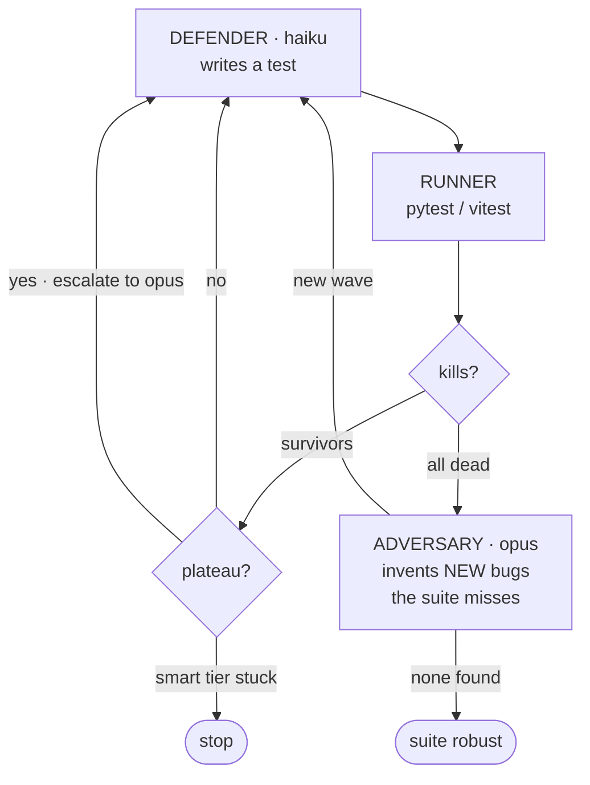

# Adversarial Testing

Two LLM agents in a mutation-testing arms race.
One **invents bugs**. The other **writes tests** that kill them.

<div class="opacity-70 mt-8 text-sm">
Pytest / vitest is the only judge. Never an LLM.
</div>

<div class="abs-br m-6 text-xs opacity-50">
2-min demo · 1-min Q&A
</div>

---
layout: two-cols-header
---

# The problem with "AI tests"

::left::

**LLM writes tests, LLM grades them.**

- "Looks reasonable" ≠ catches a bug.
- An LLM judge can hallucinate a pass.
- You ship a green suite that misses regressions.

::right::

**Our signal is ground truth.**

A mutant is killed only when the generated test:
- **passes** on the correct reference, AND
- **fails** on the mutant.

The test runner decides. No model in the loop has veto power.

---
layout: default
---

# The agent loop — beyond a Claude-Code wrapper

<div class="flex justify-center">



</div>

<div class="text-sm mt-2 opacity-70 text-center">
The board <strong>grows</strong> mid-run when the suite wins a wave — the kill-rate dips, then the defender climbs back. That's co-evolution on screen.
</div>

---
layout: two-cols-header
---

# Live: arena TUI

::left::

We didn't bury this behind logs. The loop draws itself:

- **Mutant board** — kills flash green ✓; new adversary bugs flash yellow as they're added.
- **Telemetry** — iter, kill-rate bar, tokens (with sparkline), adversary / defender model names, status spinner.
- **Event log** — `▶ run`, `✎ gen`, `✓ kill`, `! plateau → escalate`, `★ done`.
- **Convergence** — braille line chart, kill-rate vs iteration. Dips when adversary attacks, climbs when defender catches up.

::right::

```
┌ MUTANTS (3/5) ──────┐ ┌ TELEMETRY ──────────┐
│ ✓ M1_no_sort        │ │ iter      3 / 25    │
│ ✓ M3_overwrite_end  │ │ kill rate ████░ 60% │
│ ✓ M5_empty_none     │ │ tokens     4,521 ▂▅▇│
│ ● M2_strict_overlap │ │ adversary  opus     │
│ ● M4_drop_last      │ │ defender   haiku    │
└─────────────────────┘ │ status     ⠹ writing│
                        └─────────────────────┘
┌ EVENT LOG ──────────────────────────────────┐
│ ▶ iter 3: executing test vs 2 survivors     │
│ ✎ iter 3: synthesized test (+812 tokens)    │
│ ! plateau on bulk -> escalating to strategy │
└─────────────────────────────────────────────┘
```

<div class="text-xs opacity-60 mt-2">
Built with raw ANSI + braille (no Textual dep). Snapshot mode for CI.
</div>

---
layout: default
---

# Cost–quality: cheap-first, escalate on plateau

| Tier | Model | When | Cost (per Mtok in/out) |
|---|---|---|---|
| `bulk` | haiku · Qwen3-30B | Default. Writes most tests. | **$0.10 / $0.30** |
| `strategy` | opus · Qwen3-235B | Plateau detected + adversary's bug-invention. | $5.00 / $25.00 |

**Three levers, not just model choice.**

- **Plateau-driven escalation** — opus only fires when the cheap tier truly stalls.
- **Prompt caching** — stable preambles (reference src + system) ride a `cache_control` block; cached input billed at ~10% of fresh.
- **Parallelism** — repo-scan fans out one harden loop per discovered function (`TARGET_WORKERS`); each one fans out per-mutant pytest subprocesses (`MUTANT_WORKERS`).

<div class="text-sm mt-6 opacity-70">
Full-kill on the NemoClaw <code>parseDuration</code> TypeScript target end-to-end (acquire → mutate → harden): <strong>$0.0346</strong>.
</div>

---
layout: default
---

# Measurable impact

<div class="grid grid-cols-2 gap-6 mt-4">

<div class="border rounded-lg p-4 border-cyan-700">

### Toy (Python)
`merge_intervals` + 5 mutants
**Full-kill, iter 1, $0.15**
<small class="opacity-70">bulk tier alone — haiku writes one test that kills all five.</small>

</div>

<div class="border rounded-lg p-4 border-purple-700">

### NemoClaw <code>parseDuration</code> (TS)
5 mutants incl. <strong>M2_no_cap</strong> — silently removes a 30-min security cap.
**Full-kill, iter 1, $0.14**

</div>

<div class="border rounded-lg p-4 border-cyan-700">

### Any-repo CLI (TS)
`repo=NVIDIA/NemoClaw` + 5 LLM-invented, compile-checked mutants.
**Full-kill, $0.0346**

</div>

<div class="border rounded-lg p-4 border-orange-700">

### Real, harder target
`fiberplane/honcpiler parsePackageJson`. Baseline 80%. Loop reaches **88%** over 12 iters, **+1 adversary round** that invents bugs the suite missed.

</div>

</div>

<div class="text-sm mt-6 opacity-70">
Repair loop on a 3-bug fixture: one-shot fixes 1/3 for 226 tokens. Iterative loop closes <strong>3/3 for 7,638 tokens</strong> with a 100%-kill suite to prove it.
</div>

---
layout: default
---

# Quality of the loop — verification, not vibes

Every iteration emits a row to `run.jsonl`:

```json
{"iteration": 3, "tier": "strategy", "cumulative_tokens": 18387,
 "kill_rate": 0.625, "killed_this_round": [],
 "reference_passed": true, "mutant_round": 1, "total_mutants": 8}
```

- **Stop conditions are explicit:** `full_kill`, `defender_plateau`, `adversary_defeated`, `rounds_exhausted`, `budget_cap`, `max_iterations`.
- **CI bench** — `python bench.py` runs harden + repair under `BACKEND=stub` (deterministic) and diffs metrics against `bench_baseline.json`. Exact-match — *any* harness or prompt drift exits non-zero.
- **Reports auto-generated** — every run writes `report/report.md` with the convergence chart, mutants, accepted tests, surviving mutants. ([example](../report/report.md))
- **Adversary keeps it honest** — each invented mutant must compile *and* slip past the live suite before counting. Re-finding an already-caught bug is dropped.

---
layout: default
---

# Technical ambition

- **Runs LLM-generated code on real repos.** `acquire.py` fetches by URL or local path; `discover.py` LLM-selects targets; `runner_repo_ts.py` swaps the file into the repo's *own* `vitest` config so the verdict comes from the toolchain the target ships.
- **Two languages.** pytest verifier for Python, standalone `vitest` harness for TS, repo-backed `vitest` for TS at full fidelity. One contract, three runners.
- **Two products from one runner.** `main.py` hardens a suite; `repair_main.py` repairs a bug (roles inverted: fixed code = reference, buggy original = the lone mutant). `orchestrate.py` runs both phases on one budget.
- **Loud failures.** A real-backend auth error raises — never silently returns a stub. A credential bug cannot masquerade as an empty plateau.

---
layout: two-cols-header
---

# Collaboration — three angles, one contract

::left::

### Three people, three layers

- **Franri** — adversarial loop, prompt hardening, two-tier router, repair pipeline.
- **Minghe** — repo discovery (LLM-driven target selection), repo-backed TS verifier, parallelism.
- **Varun** — arena TUI, benchmark harness, demo polish.

::right::

### What made it compose

- **One frozen contract:** `run_and_check(test_src, ref, mutants) → killed_ids`. Both loops, three runners, every fixture obey it.
- **JSONL as the bus** — every component logs the same event shape, so the TUI, the report, and `bench.py` all just *read* `run.jsonl`.
- **Stub backend** — anyone could run the whole loop offline, deterministically, without burning credits or stepping on each other's prompts.

---
layout: center
class: text-center
---

# Demo flow (2 minutes)

<div class="grid grid-cols-3 gap-4 mt-8 text-sm">

<div class="border rounded p-4">

**0:00 – 0:25**
*Frame it.*
LLM-graded tests are theater. Pytest is truth.

</div>

<div class="border rounded p-4">

**0:25 – 1:30**
*Run it.*
`python demo.py --live repo=… file=… function=…` — point at the arena.
Call out: kill flash → plateau → escalate → adversary wave → climb.

</div>

<div class="border rounded p-4">

**1:30 – 2:00**
*Prove it.*
Open `bench.py` baseline + `report/report.md`. Show the convergence chart. Land on `$0.0346 for a real repo`.

</div>

</div>

<div class="mt-12 text-xl">
<strong>The pitch line:</strong>
We turned mutation testing into an arms race, ran it on real repos, and made every kill verifiable.
</div>

---
layout: center
class: text-center
---

# Try it

```bash
git clone https://github.com/Franri3008/adversarial-testing && cd adversarial-testing
python demo.py --speed normal                 # offline, deterministic
python demo.py --live                          # real LLM, toy fixture
python demo.py --live repo=NVIDIA/NemoClaw \
  file=src/lib/domain/duration.ts function=parseDuration
```

<div class="mt-12 opacity-70">
Code · report · bench all in the repo. README ships a 1-pager for judges.
</div>
