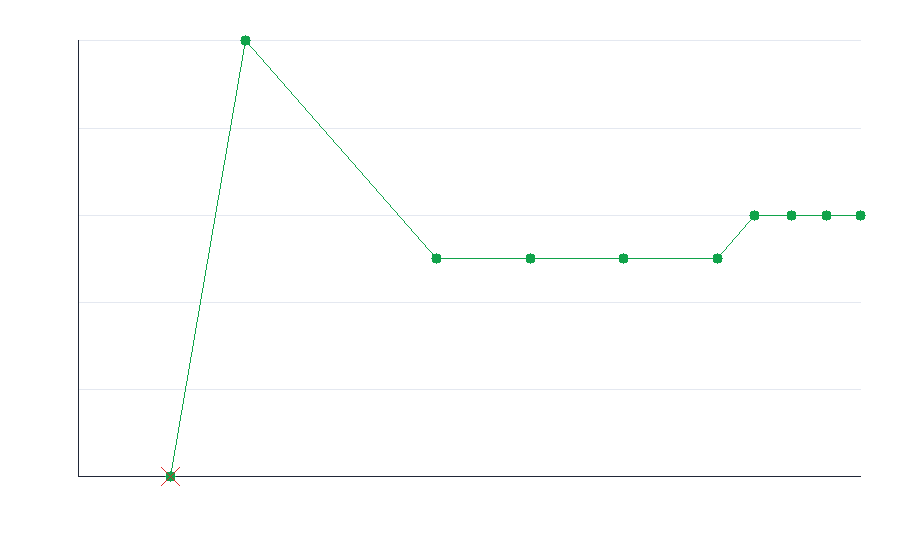

# Adversarial test-hardening report

## Target

| | |
|---|---|
| repo | `fiberplane/honcpiler` |
| file | `src/vfs/utils/semver-compare.ts` |
| function | `compareVersions` |
| language | typescript |
| strategy model | `claude-opus-4-8` |
| bulk model | `nvidia/Nemotron-3-Ultra-550b-a55b` |

## Result



- **Baseline (one cold-start test):** 0% kill rate
- **Final (hardened suite):** 60% kill rate over 10 mutants
- **Gain from looping:** +60%
- **Co-evolution:** 1 adversary round(s); 6 distinct bugs caught across waves
  (the adversary kept inventing bugs the suite missed; each wave is a dip-then-recover in the graph above)
- **Stop reason:** `-`
- **Tokens spent:** 41,129

## Run status

| event | phase | iteration | status | detail |
|---|---|---|---|---|

## Progress per iteration

| iter | tier | cum. tokens | kill rate | killed this round |
|---|---|---|---|---|
| 1 | - | 4,880 | 0% | — |
| 2 | - | 8,809 | 100% | flipped_gt_comparison, off_by_one_loop, prerelease_swapped, wrong_regex_group, min_instead_of_max |
| 3 | - | 18,835 | 50% | — |
| 4 | - | 23,773 | 50% | — |
| 5 | - | 28,711 | 50% | — |
| 6 | - | 33,649 | 50% | — |
| 7 | - | 35,586 | 60% | r1_regex_no_anchor |
| 8 | - | 37,522 | 60% | — |
| 9 | - | 39,361 | 60% | — |
| 10 | - | 41,129 | 60% | — |

## Mutants generated

| id | status | description |
|---|---|---|
| `r1_empty_array_returns_first` | surviving | getLatestVersion returns versions[0] instead of undefined for empty array (untested branch) |
| `r1_prerelease_only_v1_check` | surviving | uses startsWith('-') instead of includes('-') so embedded prerelease markers like 1.0.0-alpha still work but a leading-dash edge differs |
| `r1_radix_dropped` | surviving | parseInt called without radix 10, so leading-zero parts could parse differently for octal-like inputs not in tests |
| `r1_zero_part_coalesce` | surviving | uses ?? 0 instead of \|\| 0 for v1Part default; NaN from malformed parts no longer coerced to 0 |

<details>
<summary>r1_empty_array_returns_first source</summary>

```ts
/**
 * Returns the latest (highest) version from a list of semver version strings
 */
export function getLatestVersion(versions: string[]): string | undefined {
  if (versions.length < 0) {
    return undefined;
  }

  return versions.reduce((latest, current) => {
    return compareVersions(current, latest) > 0 ? current : latest;
  }, versions[0]);
}

/**
 * Compares two semver version strings
 */
export function compareVersions(version1: string, version2: string): number {
  const v1Parts = version1.split(".").map((part) => {
    const match = part.match(/^(\d+)(.*)$/);
    return match ? Number.parseInt(match[1], 10) : 0;
  });

  const v2Parts = version2.split(".").map((part) => {
    const match = part.match(/^(\d+)(.*)$/);
    return match ? Number.parseInt(match[1], 10) : 0;
  });

  for (let i = 0; i < Math.max(v1Parts.length, v2Parts.length); i++) {
    const v1Part = v1Parts[i] || 0;
    const v2Part = v2Parts[i] || 0;

    if (v1Part > v2Part) {
      return 1;
    }
    if (v1Part < v2Part) {
      return -1;
    }
  }

  const v1Prerelease = version1.includes("-");
  const v2Prerelease = version2.includes("-");

  if (!v1Prerelease && v2Prerelease) {
    return 1;
  }
  if (v1Prerelease && !v2Prerelease) {
    return -1;
  }

  return 0;
}
```

</details>

<details>
<summary>r1_prerelease_only_v1_check source</summary>

```ts
/**
 * Returns the latest (highest) version from a list of semver version strings
 */
export function getLatestVersion(versions: string[]): string | undefined {
  if (versions.length === 0) {
    return undefined;
  }

  return versions.reduce((latest, current) => {
    return compareVersions(current, latest) > 0 ? current : latest;
  }, versions[0]);
}

/**
 * Compares two semver version strings
 */
export function compareVersions(version1: string, version2: string): number {
  const v1Parts = version1.split(".").map((part) => {
    const match = part.match(/^(\d+)(.*)$/);
    return match ? Number.parseInt(match[1], 10) : 0;
  });

  const v2Parts = version2.split(".").map((part) => {
    const match = part.match(/^(\d+)(.*)$/);
    return match ? Number.parseInt(match[1], 10) : 0;
  });

  for (let i = 0; i < Math.max(v1Parts.length, v2Parts.length); i++) {
    const v1Part = v1Parts[i] || 0;
    const v2Part = v2Parts[i] || 0;

    if (v1Part > v2Part) {
      return 1;
    }
    if (v1Part < v2Part) {
      return -1;
    }
  }

  const v1Prerelease = version1.includes("-");
  const v2Prerelease = version2.split(".").some((p) => p.includes("-"));

  if (!v1Prerelease && v2Prerelease) {
    return 1;
  }
  if (v1Prerelease && !v2Prerelease) {
    return -1;
  }

  return 0;
}
```

</details>

<details>
<summary>r1_radix_dropped source</summary>

```ts
/**
 * Returns the latest (highest) version from a list of semver version strings
 * @param versions Array of semver version strings
 * @returns The latest version string, or undefined if the array is empty
 */
export function getLatestVersion(versions: string[]): string | undefined {
  if (versions.length === 0) {
    return undefined;
  }

  return versions.reduce((latest, current) => {
    return compareVersions(current, latest) > 0 ? current : latest;
  }, versions[0]);
}

/**
 * Compares two semver version strings
 */
export function compareVersions(version1: string, version2: string): number {
  const v1Parts = version1.split(".").map((part) => {
    const match = part.match(/^(\d+)(.*)$/);
    return match ? Number.parseInt(match[1]) : 0;
  });

  const v2Parts = version2.split(".").map((part) => {
    const match = part.match(/^(\d+)(.*)$/);
    return match ? Number.parseInt(match[1], 10) : 0;
  });

  for (let i = 0; i < Math.max(v1Parts.length, v2Parts.length); i++) {
    const v1Part = v1Parts[i] || 0;
    const v2Part = v2Parts[i] || 0;

    if (v1Part > v2Part) {
      return 1;
    }
    if (v1Part < v2Part) {
      return -1;
    }
  }

  const v1Prerelease = version1.includes("-");
  const v2Prerelease = version2.includes("-");

  if (!v1Prerelease && v2Prerelease) {
    return 1;
  }
  if (v1Prerelease && !v2Prerelease) {
    return -1;
  }

  return 0;
}
```

</details>

<details>
<summary>r1_zero_part_coalesce source</summary>

```ts
/**
 * Returns the latest (highest) version from a list of semver version strings
 */
export function getLatestVersion(versions: string[]): string | undefined {
  if (versions.length === 0) {
    return undefined;
  }

  return versions.reduce((latest, current) => {
    return compareVersions(current, latest) > 0 ? current : latest;
  }, versions[0]);
}

/**
 * Compares two semver version strings
 */
export function compareVersions(version1: string, version2: string): number {
  const v1Parts = version1.split(".").map((part) => {
    const match = part.match(/^(\d+)(.*)$/);
    return match ? Number.parseInt(match[1], 10) : 0;
  });

  const v2Parts = version2.split(".").map((part) => {
    const match = part.match(/^(\d+)(.*)$/);
    return match ? Number.parseInt(match[1], 10) : 0;
  });

  for (let i = 0; i < Math.max(v1Parts.length, v2Parts.length); i++) {
    const v1Part = v1Parts[i] ?? 0;
    const v2Part = v2Parts[i] || 0;

    if (v1Part > v2Part) {
      return 1;
    }
    if (v1Part < v2Part) {
      return -1;
    }
  }

  const v1Prerelease = version1.includes("-");
  const v2Prerelease = version2.includes("-");

  if (!v1Prerelease && v2Prerelease) {
    return 1;
  }
  if (v1Prerelease && !v2Prerelease) {
    return -1;
  }

  return 0;
}
```

</details>

## Fixes accepted

No accepted fixes were recorded.

## Fixes rejected

No rejected fixes were recorded.

## Generated adversarial tests (the changes)

The loop wrote 2 test(s) into this suite:

- [`adversarial_test_01.ts`](tests/adversarial_test_01.ts)
- [`adversarial_test_02.ts`](tests/adversarial_test_02.ts)
