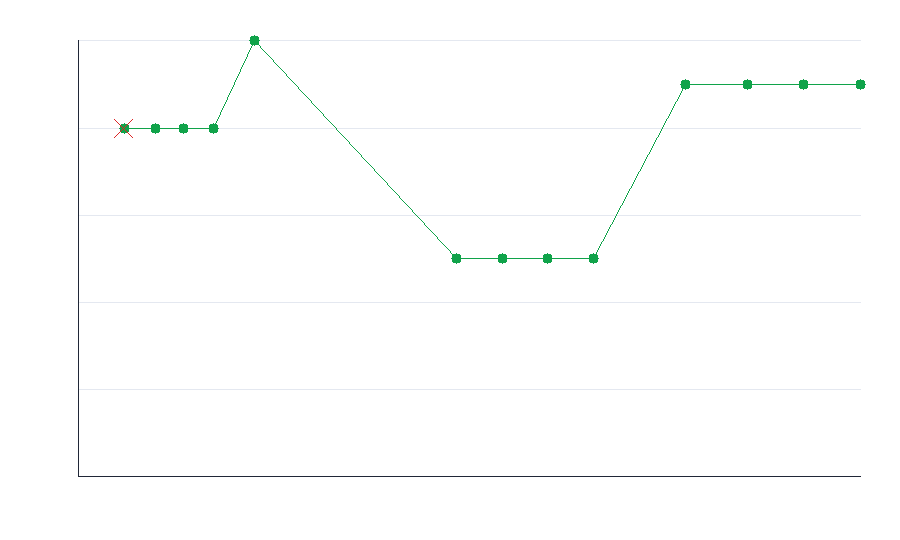

# Adversarial test-hardening report

## Target

| | |
|---|---|
| repo | `fiberplane/honcpiler` |
| file | `scripts/py/main.py` |
| function | `main` |
| language | python |
| strategy model | `claude-opus-4-8` |
| bulk model | `Qwen/Qwen3-30B-A3B-Instruct-2507` |

## Result

- **Baseline (one cold-start test):** 80% kill rate
- **Final (hardened suite):** 90% kill rate over 10 mutants
- **Gain from looping:** +10%
- **Co-evolution:** 1 adversary round(s); 9 distinct bugs caught across waves
  (the adversary kept inventing bugs the suite missed; each wave is a dip-then-recover in the graph above)
- **Tokens spent:** 6,626
- **Cost:** $0.0571

## Progress per iteration

| iter | tier | cum. tokens | kill rate | killed this round |
|---|---|---|---|---|
| 1 | bulk | 394 | 80% | wrong_string_constant, missing_exclamation, typo_in_name, no_print |
| 2 | bulk | 657 | 80% | — |
| 3 | bulk | 893 | 80% | — |
| 4 | bulk | 1,152 | 80% | — |
| 5 | strategy | 1,492 | 100% | extra_whitespace |
| 6 | bulk | 3,207 | 50% | — |
| 7 | bulk | 3,595 | 50% | — |
| 8 | bulk | 3,982 | 50% | — |
| 9 | bulk | 4,365 | 50% | — |
| 10 | strategy | 5,145 | 90% | r1_guard_swap_to_truthy_check, r1_return_value_added, r1_default_arg_unused, r1_guard_name_typo |
| 11 | strategy | 5,671 | 90% | — |
| 12 | strategy | 6,151 | 90% | — |
| 13 | strategy | 6,626 | 90% | — |

## Mutants still surviving

- `r1_dead_branch_extra_print` — Adds an unreachable branch that would print extra whitespace text

## Generated adversarial tests (the changes)

The loop wrote 3 test(s) into this suite:

- [`adversarial_test_01.py`](tests/adversarial_test_01.py)
- [`adversarial_test_02.py`](tests/adversarial_test_02.py)
- [`adversarial_test_03.py`](tests/adversarial_test_03.py)
