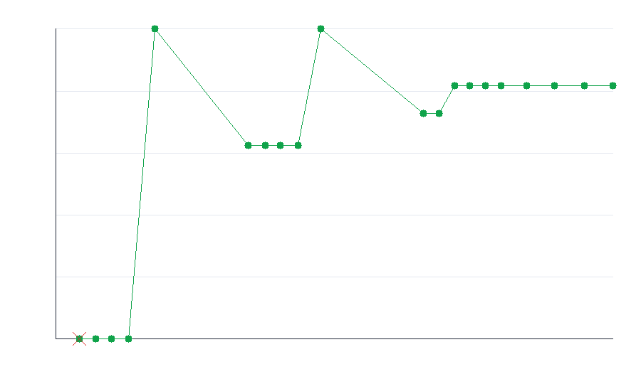

# Adversarial test-hardening report

## Target

| | |
|---|---|
| repo | `fiberplane/honcpiler` |
| file | `src/parse-packages.ts` |
| function | `parsePackageJson` |
| language | typescript |
| strategy model | `claude-opus-4-8` |
| bulk model | `Qwen/Qwen3-30B-A3B-Instruct-2507` |

## Result

- **Baseline (one cold-start test):** 0% kill rate
- **Final (hardened suite):** 82% kill rate over 11 mutants
- **Gain from looping:** +82%
- **Co-evolution:** 2 adversary round(s); 9 distinct bugs caught across waves
  (the adversary kept inventing bugs the suite missed; each wave is a dip-then-recover in the graph above)
- **Tokens spent:** 43,551
- **Cost:** $0.4200

## Progress per iteration

| iter | tier | cum. tokens | kill rate | killed this round |
|---|---|---|---|---|
| 1 | bulk | 1,862 | 0% | — |
| 2 | bulk | 3,147 | 0% | — |
| 3 | bulk | 4,380 | 0% | — |
| 4 | bulk | 5,713 | 0% | — |
| 5 | strategy | 7,777 | 100% | swap_deps_dev, flip_type_check, drop_dev_guard, wrong_path_match, dep_guard_or |
| 6 | bulk | 15,078 | 62% | — |
| 7 | bulk | 16,412 | 62% | — |
| 8 | bulk | 17,590 | 62% | — |
| 9 | bulk | 18,959 | 62% | — |
| 10 | strategy | 20,743 | 100% | r1_missing_throws_on_empty, r1_first_match_uses_last, r1_empty_string_version_skipped |
| 11 | bulk | 28,766 | 73% | — |
| 12 | bulk | 29,969 | 73% | — |
| 13 | bulk | 31,201 | 82% | r2_swallow_parse_error_returns_empty |
| 14 | bulk | 32,375 | 82% | — |
| 15 | bulk | 33,606 | 82% | — |
| 16 | bulk | 34,816 | 82% | — |
| 17 | strategy | 36,844 | 82% | — |
| 18 | strategy | 39,019 | 82% | — |
| 19 | strategy | 41,348 | 82% | — |
| 20 | strategy | 43,551 | 82% | — |

## Mutants still surviving

- `r2_path_match_exact_slash_dropped` — Removes the '/package.json' exact-match branch; still passes since tests use 'package.json', '/package.json' (caught by endsWith), and nested paths.
- `r2_dedupe_dependencies_silently` — Skips duplicate dependency names (keeps first), introducing data loss on repeated keys — never exercised since JSON objects can't have duplicate keys in test inputs.

## Generated adversarial tests (the changes)

The loop wrote 3 test(s) into this suite:

- [`adversarial_test_01.ts`](tests/adversarial_test_01.ts)
- [`adversarial_test_02.ts`](tests/adversarial_test_02.ts)
- [`adversarial_test_03.ts`](tests/adversarial_test_03.ts)
