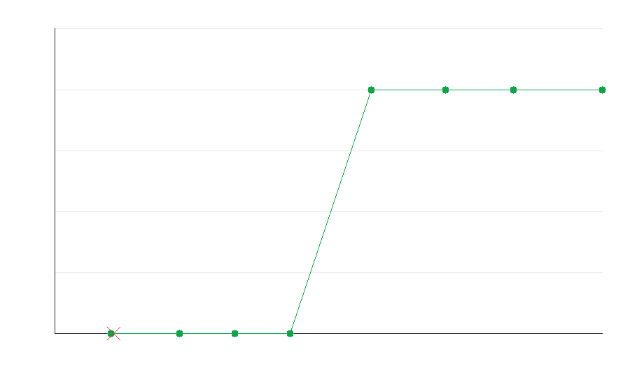

# Adversarial test-hardening report

## Target

| | |
|---|---|
| repo | `fiberplane/honcpiler` |
| file | `src/vfs/utils/semver-compare.ts` |
| function | `compareVersions` |
| language | typescript |
| strategy model | `claude-opus-4-8` |
| bulk model | `Qwen/Qwen3-30B-A3B-Instruct-2507` |

## Result

- **Baseline (one cold-start test):** 0% kill rate
- **Final (hardened suite):** 80% kill rate over 5 mutants
- **Gain from looping:** +80%
- **Tokens spent:** 12,757
- **Cost:** $0.1021

## Progress per iteration

| iter | tier | cum. tokens | kill rate | killed this round |
|---|---|---|---|---|
| 1 | bulk | 1,317 | 0% | — |
| 2 | bulk | 2,910 | 0% | — |
| 3 | bulk | 4,205 | 0% | — |
| 4 | bulk | 5,493 | 0% | — |
| 5 | strategy | 7,377 | 80% | flipped_gt_lt, prerelease_flipped, wrong_default_part, swapped_v2_separator |
| 6 | strategy | 9,111 | 80% | — |
| 7 | strategy | 10,687 | 80% | — |
| 8 | strategy | 12,757 | 80% | — |

## Mutants still surviving

- `off_by_one_loop` — Loop uses i <= Math.max(...) causing off-by-one over-iteration

## Generated adversarial tests (the changes)

The loop wrote 1 test(s) into this suite:

- [`adversarial_test_01.ts`](tests/adversarial_test_01.ts)
