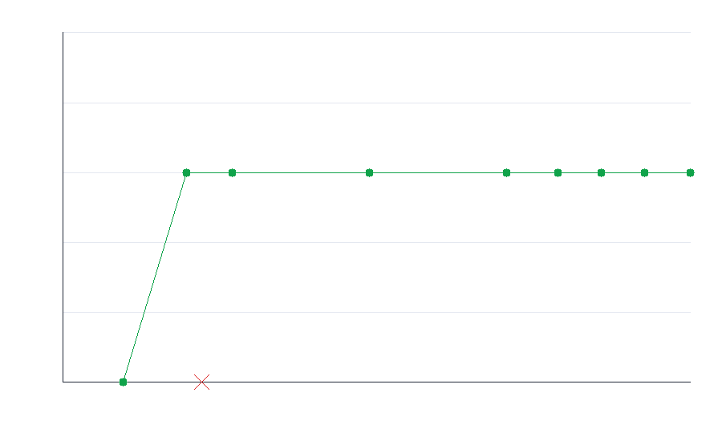

# Adversarial test-hardening report

## Target

| | |
|---|---|
| repo | `fiberplane/honcpiler` |
| file | `src/vfs/utils/semver-compare.ts` |
| function | `getLatestVersion` |
| language | typescript |
| strategy model | `claude-opus-4-8` |
| bulk model | `nvidia/Nemotron-3-Ultra-550b-a55b` |

## Result



- **Baseline (one cold-start test):** 0% kill rate
- **Final (hardened suite):** 60% kill rate over 5 mutants
- **Gain from looping:** +60%
- **Stop reason:** `defender_plateau`
- **Tokens spent:** 22,515
- **Cost:** $0.0597

## Run status

| event | phase | iteration | status | detail |
|---|---|---|---|---|
| run_started | harden | - | running | - |
| mutants_generated | harden | - | generated | 5 mutant(s) |
| iteration_completed | harden | 1 | completed | - |
| iteration_completed | harden | 2 | completed | - |
| iteration_completed | harden | 3 | completed | - |
| iteration_completed | harden | 4 | completed | - |
| iteration_completed | harden | 5 | completed | - |
| iteration_completed | harden | 6 | completed | - |
| iteration_completed | harden | 7 | completed | - |
| iteration_completed | harden | 8 | completed | - |
| iteration_completed | harden | 9 | completed | - |
| run_finished | harden | - | stopped | defender_plateau |

## Progress per iteration

| iter | tier | cum. tokens | kill rate | killed this round |
|---|---|---|---|---|
| 1 | bulk | 2,160 | 0% | — |
| 2 | bulk | 4,446 | 60% | flipped_comparison, wrong_initial_accumulator, swapped_compare_args |
| 3 | bulk | 6,084 | 60% | — |
| 4 | bulk | 11,015 | 60% | — |
| 5 | bulk | 15,946 | 60% | — |
| 6 | strategy | 17,769 | 60% | — |
| 7 | strategy | 19,338 | 60% | — |
| 8 | strategy | 20,891 | 60% | — |
| 9 | strategy | 22,515 | 60% | — |

## Mutants generated

| id | status | description |
|---|---|---|
| `dropped_empty_guard` | surviving | Removed empty-array guard so empty input returns versions[0] (undefined-ish) not undefined cleanly |
| `flipped_comparison` | killed | Flipped comparison operator returns lowest version instead of highest |
| `ge_zero_comparison` | surviving | Uses >= 0 so equal versions still replace, but behavior differs for ties |
| `swapped_compare_args` | killed | Swapped arguments to compareVersions inverts selection logic |
| `wrong_initial_accumulator` | killed | Uses versions[1] as reduce seed, skipping/breaking on single-element arrays |

<details>
<summary>dropped_empty_guard source</summary>

```ts
/**
 * Returns the latest (highest) version from a list of semver version strings
 * @param versions Array of semver version strings
 * @returns The latest version string, or undefined if the array is empty
 */
export function getLatestVersion(versions: string[]): string | undefined {
  return versions.reduce((latest, current) => {
    return compareVersions(current, latest) > 0 ? current : latest;
  }, versions[0]);
}

/**
 * Compares two semver version strings
 * @param {string} version1 - First version to compare
 * @param {string} version2 - Second version to compare
 * @returns {number} 1 if version1 is greater, -1 if version1 is less, 0 if equal
 */
export function compareVersions(version1: string, version2: string): number {
  const v1Parts = version1.split(".").map((part) => {
    // Extract any prerelease or build metadata
    const match = part.match(/^(\d+)(.*)$/);
    return match ? Number.parseInt(match[1], 10) : 0;
  });

  const v2Parts = version2.split(".").map((part) => {
    const match = part.match(/^(\d+)(.*)$/);
    return match ? Number.parseInt(match[1], 10) : 0;
  });

  // Compare major, minor, patch
  for (let i = 0; i < Math.max(v1Parts.length, v2Parts.length); i++) {
    const v1Part = v1Parts[i] || 0;
    const v2Part = v2Parts[i] || 0;

    if (v1Part > v2Part) {
      return 1;
    }
    if (v1Part < v2Part) {
      return -1;
    }
  }

  // Handle prerelease tags (prerelease versions are lower than release versions)
  const v1Prerelease = version1.includes("-");
  const v2Prerelease = version2.includes("-");

  if (!v1Prerelease && v2Prerelease) {
    return 1;
  }
  if (v1Prerelease && !v2Prerelease) {
    return -1;
  }

  return 0;
}
```

</details>

<details>
<summary>flipped_comparison source</summary>

```ts
/**
 * Returns the latest (highest) version from a list of semver version strings
 * @param versions Array of semver version strings
 * @returns The latest version string, or undefined if the array is empty
 */
export function getLatestVersion(versions: string[]): string | undefined {
  if (versions.length === 0) {
    return undefined;
  }

  return versions.reduce((latest, current) => {
    return compareVersions(current, latest) < 0 ? current : latest;
  }, versions[0]);
}

/**
 * Compares two semver version strings
 * @param {string} version1 - First version to compare
 * @param {string} version2 - Second version to compare
 * @returns {number} 1 if version1 is greater, -1 if version1 is less, 0 if equal
 */
export function compareVersions(version1: string, version2: string): number {
  const v1Parts = version1.split(".").map((part) => {
    // Extract any prerelease or build metadata
    const match = part.match(/^(\d+)(.*)$/);
    return match ? Number.parseInt(match[1], 10) : 0;
  });

  const v2Parts = version2.split(".").map((part) => {
    const match = part.match(/^(\d+)(.*)$/);
    return match ? Number.parseInt(match[1], 10) : 0;
  });

  // Compare major, minor, patch
  for (let i = 0; i < Math.max(v1Parts.length, v2Parts.length); i++) {
    const v1Part = v1Parts[i] || 0;
    const v2Part = v2Parts[i] || 0;

    if (v1Part > v2Part) {
      return 1;
    }
    if (v1Part < v2Part) {
      return -1;
    }
  }

  // Handle prerelease tags (prerelease versions are lower than release versions)
  const v1Prerelease = version1.includes("-");
  const v2Prerelease = version2.includes("-");

  if (!v1Prerelease && v2Prerelease) {
    return 1;
  }
  if (v1Prerelease && !v2Prerelease) {
    return -1;
  }

  return 0;
}
```

</details>

<details>
<summary>ge_zero_comparison source</summary>

```ts
/**
 * Returns the latest (highest) version from a list of semver version strings
 * @param versions Array of semver version strings
 * @returns The latest version string, or undefined if the array is empty
 */
export function getLatestVersion(versions: string[]): string | undefined {
  if (versions.length === 0) {
    return undefined;
  }

  return versions.reduce((latest, current) => {
    return compareVersions(current, latest) >= 0 ? current : latest;
  }, versions[0]);
}

/**
 * Compares two semver version strings
 * @param {string} version1 - First version to compare
 * @param {string} version2 - Second version to compare
 * @returns {number} 1 if version1 is greater, -1 if version1 is less, 0 if equal
 */
export function compareVersions(version1: string, version2: string): number {
  const v1Parts = version1.split(".").map((part) => {
    // Extract any prerelease or build metadata
    const match = part.match(/^(\d+)(.*)$/);
    return match ? Number.parseInt(match[1], 10) : 0;
  });

  const v2Parts = version2.split(".").map((part) => {
    const match = part.match(/^(\d+)(.*)$/);
    return match ? Number.parseInt(match[1], 10) : 0;
  });

  // Compare major, minor, patch
  for (let i = 0; i < Math.max(v1Parts.length, v2Parts.length); i++) {
    const v1Part = v1Parts[i] || 0;
    const v2Part = v2Parts[i] || 0;

    if (v1Part > v2Part) {
      return 1;
    }
    if (v1Part < v2Part) {
      return -1;
    }
  }

  // Handle prerelease tags (prerelease versions are lower than release versions)
  const v1Prerelease = version1.includes("-");
  const v2Prerelease = version2.includes("-");

  if (!v1Prerelease && v2Prerelease) {
    return 1;
  }
  if (v1Prerelease && !v2Prerelease) {
    return -1;
  }

  return 0;
}
```

</details>

<details>
<summary>swapped_compare_args source</summary>

```ts
/**
 * Returns the latest (highest) version from a list of semver version strings
 * @param versions Array of semver version strings
 * @returns The latest version string, or undefined if the array is empty
 */
export function getLatestVersion(versions: string[]): string | undefined {
  if (versions.length === 0) {
    return undefined;
  }

  return versions.reduce((latest, current) => {
    return compareVersions(latest, current) > 0 ? current : latest;
  }, versions[0]);
}

/**
 * Compares two semver version strings
 * @param {string} version1 - First version to compare
 * @param {string} version2 - Second version to compare
 * @returns {number} 1 if version1 is greater, -1 if version1 is less, 0 if equal
 */
export function compareVersions(version1: string, version2: string): number {
  const v1Parts = version1.split(".").map((part) => {
    // Extract any prerelease or build metadata
    const match = part.match(/^(\d+)(.*)$/);
    return match ? Number.parseInt(match[1], 10) : 0;
  });

  const v2Parts = version2.split(".").map((part) => {
    const match = part.match(/^(\d+)(.*)$/);
    return match ? Number.parseInt(match[1], 10) : 0;
  });

  // Compare major, minor, patch
  for (let i = 0; i < Math.max(v1Parts.length, v2Parts.length); i++) {
    const v1Part = v1Parts[i] || 0;
    const v2Part = v2Parts[i] || 0;

    if (v1Part > v2Part) {
      return 1;
    }
    if (v1Part < v2Part) {
      return -1;
    }
  }

  // Handle prerelease tags (prerelease versions are lower than release versions)
  const v1Prerelease = version1.includes("-");
  const v2Prerelease = version2.includes("-");

  if (!v1Prerelease && v2Prerelease) {
    return 1;
  }
  if (v1Prerelease && !v2Prerelease) {
    return -1;
  }

  return 0;
}
```

</details>

<details>
<summary>wrong_initial_accumulator source</summary>

```ts
/**
 * Returns the latest (highest) version from a list of semver version strings
 * @param versions Array of semver version strings
 * @returns The latest version string, or undefined if the array is empty
 */
export function getLatestVersion(versions: string[]): string | undefined {
  if (versions.length === 0) {
    return undefined;
  }

  return versions.reduce((latest, current) => {
    return compareVersions(current, latest) > 0 ? current : latest;
  }, versions[1]);
}

/**
 * Compares two semver version strings
 * @param {string} version1 - First version to compare
 * @param {string} version2 - Second version to compare
 * @returns {number} 1 if version1 is greater, -1 if version1 is less, 0 if equal
 */
export function compareVersions(version1: string, version2: string): number {
  const v1Parts = version1.split(".").map((part) => {
    // Extract any prerelease or build metadata
    const match = part.match(/^(\d+)(.*)$/);
    return match ? Number.parseInt(match[1], 10) : 0;
  });

  const v2Parts = version2.split(".").map((part) => {
    const match = part.match(/^(\d+)(.*)$/);
    return match ? Number.parseInt(match[1], 10) : 0;
  });

  // Compare major, minor, patch
  for (let i = 0; i < Math.max(v1Parts.length, v2Parts.length); i++) {
    const v1Part = v1Parts[i] || 0;
    const v2Part = v2Parts[i] || 0;

    if (v1Part > v2Part) {
      return 1;
    }
    if (v1Part < v2Part) {
      return -1;
    }
  }

  // Handle prerelease tags (prerelease versions are lower than release versions)
  const v1Prerelease = version1.includes("-");
  const v2Prerelease = version2.includes("-");

  if (!v1Prerelease && v2Prerelease) {
    return 1;
  }
  if (v1Prerelease && !v2Prerelease) {
    return -1;
  }

  return 0;
}
```

</details>

## Fixes accepted

No accepted fixes were recorded.

## Fixes rejected

No rejected fixes were recorded.

## Generated adversarial tests (the changes)

The loop wrote 1 test(s) into this suite:

- [`adversarial_test_01.ts`](tests/adversarial_test_01.ts)
